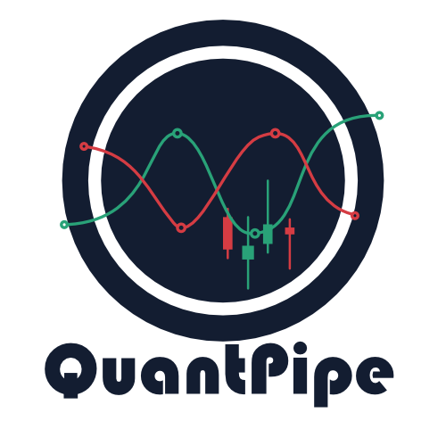

# 

QuantPipe is an open-source FOREX automated trading infrastructure designed for strategy backtesting, forward testing, and live execution using the Match-Trader API or MetaTrader (MT4/MT5). It allows traders and developers to research strategies offline and deploy the same logic into automated trading environments.

## Overview

QuantPipe provides a modular framework for developing, testing, and deploying algorithmic trading strategies in the FOREX market. It includes a general-purpose backtesting engine, dataset partitioning tools for test and validation workflows, and reusable risk management components.

The project is motivated in part by the requirements of proprietary trading firms such as City Traders Imperium (CTI), where U.S.-based traders are required to use Match-Trader rather than MetaTrader. As a result, QuantPipe is designed to support multiple execution platforms, including MetaTrader (MT4/MT5) and Match-Trader, while maintaining a single, consistent strategy and risk management codebase across backtesting, forward testing, and live trading.

## Quick Start (3 Commands)

```powershell
# 1. Install dependencies (requires Poetry)
poetry install

# 2. Run a sample backtest (uses default test dataset)
poetry run quantpipe backtest --pair EURUSD --direction LONG

# 3. (Optional) JSON output with validate dataset
poetry run quantpipe backtest `
--pair EURUSD `
--dataset validate `
--direction BOTH `
--output-format json > results.json
```

If you have only raw data, first build processed partitions (see Backtesting docs below).

## Data Directory Structure

The `price_data/` directory is excluded from version control (`.gitignore`) and must be created locally. The expected structure is:

```text
price_data/
├── processed/
│   ├── eurusd/
│   │   ├── test/
│   │   │   ├── eurusd_test.parquet
│   │   │   └── eurusd_test.csv
│   │   └── validate/
│   │       ├── eurusd_validate.parquet
│   │       └── eurusd_validate.csv
│   └── usdjpy/
│       ├── test/
│       └── validate/
├── raw/
│   ├── eurusd/
│   │   ├── DAT_MT_EURUSD_M1_2000.csv
│   │   ├── DAT_MT_EURUSD_M1_2001.csv
│   │   ├── ...
│   │   └── DAT_MT_EURUSD_M1_2024.csv
│   └── usdjpy/
│       ├── DAT_MT_USDJPY_M1_2000.csv
│       ├── DAT_MT_USDJPY_M1_2001.csv
│       ├── ...
│       └── DAT_MT_USDJPY_M1_2024.csv
└── raw_converted/                       # Raw MetaTrader data converted to add headers
    ├── eurusd/
    │   ├── DAT_MT_EURUSD_M1_2000.csv
    │   ├── DAT_MT_EURUSD_M1_2001.csv
    │   ├── ...
    │   └── DAT_MT_EURUSD_M1_2024.csv
    └── usdjpy/
        ├── DAT_MT_USDJPY_M1_2000.csv
        ├── DAT_MT_USDJPY_M1_2001.csv
        ├── ...
        └── DAT_MT_USDJPY_M1_2024.csv
```

**Default Paths**: When `--data` is omitted, the CLI auto-constructs the path using `--pair` and `--dataset`. The CLI automatically tries `.parquet` first (faster), then falls back to `.csv` if Parquet is not available:

```powershell
# Uses: price_data/processed/eurusd/test/eurusd_test.parquet (or .csv if .parquet not found)
poetry run quantpipe backtest --pair EURUSD --direction LONG

# Uses: price_data/processed/usdjpy/validate/usdjpy_validate.parquet (or .csv if .parquet not found)
poetry run quantpipe backtest --pair USDJPY --dataset validate --direction BOTH

# Custom data path (overrides auto-construction)
poetry run quantpipe backtest --data custom/path/data.csv --direction LONG
```

**File Format Support**: Both Parquet (.parquet) and CSV (.csv) formats are supported. Parquet files are loaded directly for optimal performance, while CSV files are automatically preprocessed (MetaTrader format conversion) and cached as Parquet for future runs.

**Note**: You must create the `price_data/` directory and populate it with your own price data. See the Backtesting section below for instructions on converting raw data to processed partitions.

## Basic CLI Usage

| Flag              | Values                | Default    | Purpose                                                     |
| ----------------- | --------------------- | ---------- | ----------------------------------------------------------- |
| `--pair`          | EURUSD, USDJPY, etc.  | EURUSD     | Currency pair (auto-constructs data path if --data omitted) |
| `--dataset`       | `test` `validate`     | `test`     | Dataset partition when using auto-constructed path          |
| `--data`          | PATH                  | (optional) | Custom data file path (overrides auto-construction)         |
| `--direction`     | `LONG` `SHORT` `BOTH` | `LONG`     | Trade direction mode                                        |
| `--timeframe`     | `1m` `15m` `1h` etc.  | `1m`       | Resample to target timeframe (see below)                    |
| `--output-format` | `text` `json`         | `text`     | Output format                                               |
| `--dry-run`       | (flag)                | off        | Emit signals only (no execution)                            |
| `--config`        | PATH                  | (optional) | YAML config file for defaults                               |

### Multi-Timeframe Backtesting

Run strategies on higher timeframes by resampling from 1-minute data:

```powershell
# 15-minute bars
poetry run quantpipe backtest --pair EURUSD --direction BOTH --timeframe 15m

# 1-hour bars
poetry run quantpipe backtest --pair EURUSD --direction LONG --timeframe 1h

# Arbitrary timeframes (7m, 90m, etc.)
poetry run quantpipe backtest --pair EURUSD --timeframe 7m --direction BOTH
```

Supported formats: `Xm` (minutes), `Xh` (hours), `Xd` (days). Any positive integer works.

Resampled data is cached in `.time_cache/` for faster repeated runs. See `docs/timeframes.md` for details.

### Multi-Strategy Support

Run multiple strategies simultaneously with weighted portfolio aggregation:

```powershell
# Register and list strategies
poetry run quantpipe backtest --register-strategy alpha --strategy-module my_strategies.alpha
poetry run quantpipe backtest --list-strategies

# Execute specific strategies with custom weights
poetry run quantpipe backtest `
--pair EURUSD `
--strategies alpha beta `
--weights 0.6 0.4

# Equal-weight fallback (no weights specified)
poetry run quantpipe backtest `
--pair EURUSD `
--strategies alpha beta gamma
```

See `specs/006-multi-strategy/spec.md` for details on strategy registration, filtering, and risk management.

Example (signals only):

```powershell
poetry run quantpipe backtest --pair EURUSD --dry-run
```

## Multi-Symbol Portfolio Backtesting

Run backtests across multiple currency pairs with independent or portfolio execution modes:

### Independent Mode (Default)

Each symbol runs in isolation with separate capital and risk limits:

```powershell
# Run 3 symbols independently
poetry run quantpipe backtest `
--direction BOTH `
--pair EURUSD GBPUSD USDJPY `
--portfolio-mode independent
```

**Features:**

- Separate $10,000 capital per symbol
- Isolated risk management
- Failures don't affect other symbols
- Aggregated summary statistics

### Portfolio Mode

Shared capital pool with correlation tracking and dynamic allocation:

```powershell
# Run portfolio mode with custom correlation threshold
poetry run quantpipe backtest `
--direction BOTH `
--pair EURUSD GBPUSD USDJPY `
--portfolio-mode portfolio `
--correlation-threshold 0.75 `
--snapshot-interval 50
```

**Features:**

- Shared capital pool ($10,000 total)
- Dynamic allocation based on volatility
- Correlation matrix tracking (100-candle rolling window)
- Diversification metrics (ratio, effective assets)
- Periodic snapshots (JSONL format)

### Symbol Filtering

Exclude specific symbols at runtime:

```powershell
# Run all pairs except GBPUSD
poetry run quantpipe backtest `
--direction LONG `
--pair EURUSD GBPUSD USDJPY NZDUSD `
--disable-symbol GBPUSD
```

Invalid symbols (missing datasets) are automatically skipped with warnings.

### CLI Flags Reference

| Flag                      | Values                 | Default     | Purpose                             |
| ------------------------- | ---------------------- | ----------- | ----------------------------------- |
| `--pair`                  | EURUSD GBPUSD ...      | (required)  | Currency pairs to backtest          |
| `--portfolio-mode`        | independent, portfolio | independent | Execution mode                      |
| `--disable-symbol`        | EURUSD ...             | (none)      | Exclude symbols from execution      |
| `--correlation-threshold` | 0.0-1.0                | 0.8         | Portfolio correlation warning level |
| `--snapshot-interval`     | integer                | 50          | Snapshot frequency (candles)        |

See `specs/008-multi-symbol/quickstart.md` for detailed examples and output formats.

## Performance Optimization

The backtesting engine achieves production-grade performance through columnar operations and vectorization:

**Spec 010 Achievements** (Scan & Simulation Optimization):

- **Scan Performance**: ≥50% speedup (≤720s for 6.9M candles) via Polars columnar engine
- **Simulation Performance**: ≥55% speedup (≤480s for ~85k trades) via NumPy vectorization
- **Memory Efficiency**: ≤2GB peak, linear O(n) scaling, 30% reduction from baseline
- **Progress Tracking**: Real-time updates with ≤1% overhead (16,384-item stride)
- **Equivalence Validation**: ±0.5% PnL tolerance maintained across optimization
- **Deterministic Results**: ±1% timing variance, ±0.5% PnL variance over 3 runs

**Technology Stack**:

- **Polars 1.17.0** (mandatory): Columnar data engine for 20-30% preprocessing speedup
- **NumPy 2.0+**: Vectorized trade simulation (10×+ speedup vs iteration)
- **Parquet Support**: 3-5× faster IO than CSV with zstd compression

**Key Features**:

- Partial dataset iteration: `--data-frac 0.25` for quick validation
- Profiling: `--profile` flag generates hotspot analysis + benchmark JSON
- Progress tracking: Real-time phase timing with elapsed/remaining estimates
- LazyFrame evaluation: Deferred computation with Polars query optimization

**Quick Examples**:

```powershell
# Standard optimized backtest (Polars automatic)
poetry run quantpipe backtest `
--pair EURUSD `
--direction BOTH

# Profile with first 25% of data
poetry run quantpipe backtest `
--pair EURUSD `
--direction BOTH `
--data-frac 0.25 `
--profile
```

**Performance Validation**:

```bash
# Run comprehensive performance test suite
poetry run pytest tests/performance/ -v

# Specific benchmarks
poetry run pytest tests/performance/test_scan_perf.py -v        # Scan ≤720s
poetry run pytest tests/performance/test_sim_perf.py -v         # Simulation ≤480s
poetry run pytest tests/performance/test_progress_overhead.py -v # Overhead ≤1%
```

See `docs/performance.md` for complete optimization guide, architecture details, and lessons learned.

## Interactive Visualization

Add `--visualize` to any backtest command for interactive charting:

```powershell
poetry run quantpipe backtest --pair EURUSD --direction BOTH --visualize
```

**Features:**

- OHLC candlestick chart with linked panning
- EMA overlays (20/50/200)
- Stochastic RSI panel (0-1 scale with 0.5 center line)
- Trade entry/exit markers with TP/SL level lines
- Portfolio value curve
- Metrics panel with win rate, expectancy, profit factor

**Navigation:** Drag to pan, scroll to zoom, double-click to reset. All charts share x-axis.

See `docs/visualization.md` for complete guide and troubleshooting.

## Ingestion Architecture

The data ingestion layer is designed for high performance and modularity, separating core data loading from optional indicator computation.

### Two-Stage Pipeline

**Stage 1: Core Ingestion** (`src/io/ingestion.py`)

- Loads raw OHLCV data from CSV files
- Vectorized operations: sort → deduplicate → validate cadence → fill gaps → enforce schema
- Outputs **only core columns**: `timestamp`, `open`, `high`, `low`, `close`, `volume`, `is_gap`
- Performance: ~138k rows/second sustained (6.9M candles in ≤120s)
- Arrow backend with automatic fallback for optimal performance

**Stage 2: Indicator Enrichment** (`src/indicators/enrich.py`)

- **Opt-in**: Strategies select only needed indicators (e.g., `ema_20`, `atr_14`, `stochrsi`)
- Pluggable registry for built-in and custom indicators
- Preserves core data immutability (hash verification)
- Strict mode: fast-fail on unknown indicators
- Non-strict mode: collect errors, compute what's possible

### Key Benefits

- **Performance**: 83× faster than previous monolithic approach (7.22s vs ~2min for 1M rows)
- **Modularity**: Strategies only pay for indicators they use
- **Memory**: ≥25% reduction via selective enrichment
- **Maintainability**: Clear separation of concerns (data vs computation)

### Quick Example

```python
from src.io.ingestion import ingest_candles
from src.indicators.enrich import enrich_with_indicators

# Stage 1: Fast core ingestion
core_df = ingest_candles("price_data/raw/eurusd/2024.csv")
# Result: timestamp, open, high, low, close, volume, is_gap

# Stage 2: Selective enrichment
enriched_df = enrich_with_indicators(
    core_df,
    indicators=["ema_20", "ema_50", "atr_14"],
    strict=True  # Fail if any indicator unavailable
)
# Result: core columns + ema_20 + ema_50 + atr_14
```

### Adding Custom Indicators

See `src/indicators/README.md` for complete guide with:

- 5-step development process (compute → test → register → use → document)
- Code templates with type hints and validation
- Common pitfalls (mutation, row loops, NaN handling)
- Development checklist

**Core Principles**:

- **Vectorized**: No per-row loops (enforced by Ruff linting)
- **Immutable**: Never modify input arrays
- **NaN-aware**: Propagate NaN for gaps/invalid data
- **Validated**: Check inputs, raise clear errors

See `specs/009-optimize-ingestion/` for detailed architecture documentation.

## Documentation & Resources

| Audience                       | Where to Look                      |
| ------------------------------ | ---------------------------------- |
| Deeper strategy rationale      | `docs/strategies.md`               |
| Backtesting & dataset workflow | `docs/backtesting.md`              |
| Interactive visualization      | `docs/visualization.md`            |
| Performance optimization       | `docs/performance.md`              |
| Repository layout overview     | `docs/structure.md`                |
| Contributing / dev setup       | `CONTRIBUTING.md`                  |
| Full original specification    | `specs/001-trend-pullback/spec.md` |
| Additional feature specs       | `specs/` directory                 |

## Data Expectations (Summary)

Minimum columns: `timestamp,open,high,low,close,volume` (chronological, UTC). Build standardized partitions before split-mode testing; details in Backtesting docs.

## Why Separate Docs?

The README remains a fast on-ramp. All contributor, performance, and extended methodological details have been relocated to keep first-use success under five minutes.

## License

Proprietary – All Rights Reserved.

## Governance

See `CONTRIBUTING.md` for quality gates and contribution workflow. Architectural principles live in `.specify/memory/constitution.md`.
