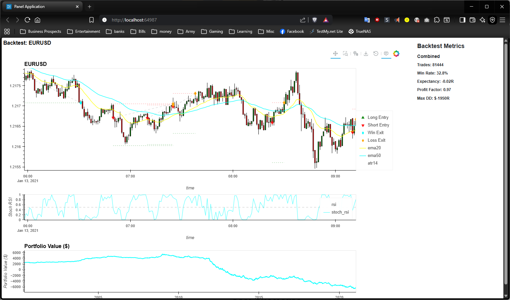

# Visualization Guide



This document describes the interactive visualization system for backtest results.

## Quick Start

Add `--visualize` to any backtest command to open an interactive chart:

```powershell
poetry run quantpipe backtest --pair EURUSD --direction BOTH --visualize
```

## Features

### Price Chart with Candlesticks

- OHLC candlestick chart with proper datetime x-axis
- Initial zoom to last ~3.2 hours of data (navigable to full dataset)
- Custom hover tooltips showing formatted datetime and price levels
- Dynamic decimal places (5 for standard pairs, 3 for JPY pairs)

### Indicator Overlays

**Price Overlays** (on candlestick chart):

- EMA20 (yellow)
- EMA50 (cyan)
- EMA200 (magenta, if available)

**Oscillator Panel** (below price chart):

- Stochastic RSI (0-1 scale)
- Center line at 0.5
- Linked x-axis with price chart for synchronized panning

### Trade Markers

**Entry Markers**:

- Green triangles: Long entries
- Red inverted triangles: Short entries

**Exit Markers**:

- Cyan diamonds: Winning trades (pnl_r > 0)
- Orange diamonds: Losing trades (pnl_r ≤ 0)

### Trade Level Lines

For the last 100 trades in the visible range:

- **Entry-Exit connecting lines**: Gray dashed
- **Take Profit (TP) level**: Green dotted horizontal
- **Stop Loss (SL) level**: Red dotted horizontal

### Portfolio Value Chart

- Shows cumulative portfolio value over time
- Based on $2,500 initial balance with $6.25 per 1R

### Metrics Panel

Displayed to the right of the chart:

- Trade count
- Win rate
- Expectancy (R)
- Profit Factor
- Max Drawdown (R)

Separate sections for Combined, Long, and Short metrics when running in BOTH mode.

## Navigation

| Action       | Effect                            |
| ------------ | --------------------------------- |
| Drag         | Pan chart horizontally/vertically |
| Scroll wheel | Zoom in/out                       |
| Double-click | Reset zoom                        |
| Box select   | Zoom to selection                 |

All charts (price, oscillator, portfolio) share the x-axis and pan together.

## Technical Notes

### Dependencies

The visualization system uses:

- **HoloViews**: High-level plotting library
- **hvPlot**: Pandas/Polars plotting extension
- **Panel**: Dashboard framework
- **Bokeh**: Interactive web-based rendering

### Performance

- Maximum 500,000 candles supported
- Trade lines limited to last 100 for rendering performance
- Datashader integration available for extreme data volumes

### Datetime Handling

All timestamps are normalized to `datetime64[ns]` timezone-naive format using the `_to_naive_datetime()` helper to ensure consistent type handling across all overlay layers.

## Troubleshooting

| Issue                  | Solution                                                      |
| ---------------------- | ------------------------------------------------------------- |
| Chart doesn't open     | Ensure browser allows popups from localhost                   |
| Slow rendering         | Reduce date range or use `--end-date` flag                    |
| Indicators not visible | Check that indicators are computed (requires enrichment step) |
| Trade lines missing    | Limited to last 100 trades for performance                    |

## Example Commands

```powershell
# Basic visualization
poetry run quantpipe backtest --pair EURUSD --visualize --direction BOTH

# With date range
poetry run quantpipe backtest --pair EURUSD --visualize --direction LONG --start-date 2021-01-01 --end-date 2021-01-31

# Save to file (HTML)
poetry run quantpipe backtest --pair EURUSD --visualize --output-file results.html
```
