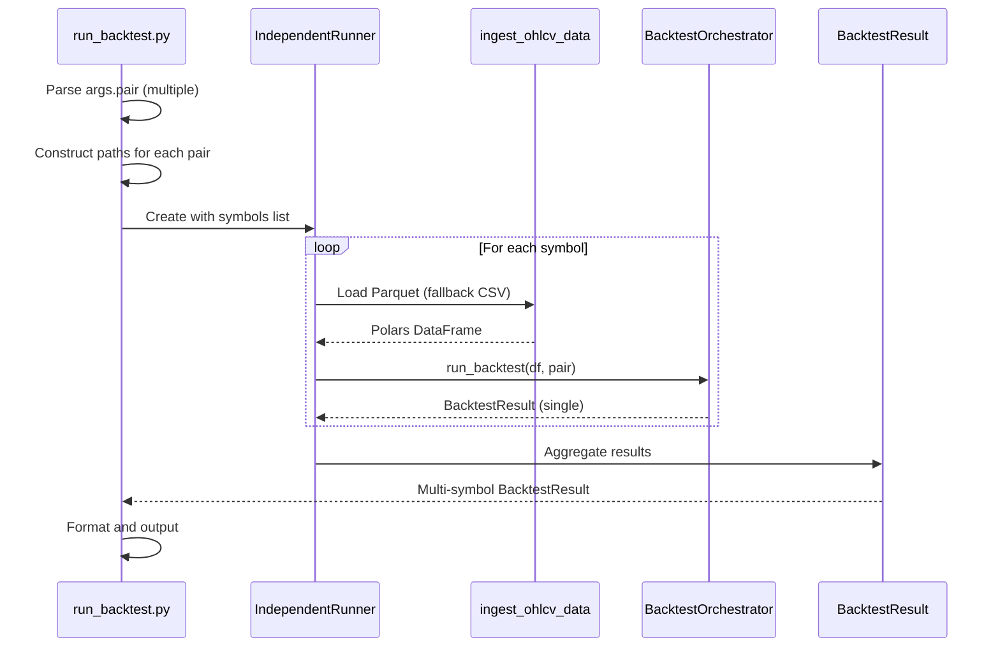

# Data Model: Multi-Symbol Concurrent Backtest

**Feature**: 013-multi-symbol-backtest
**Date**: 2025-12-18

## Entities

### Modified: BacktestResult

Already supports multi-symbol via existing fields:

| Field      | Type                       | Description |
| ---------- | -------------------------- | ----------- | ----------------------------------------------- |
| `pair`     | `str                       | None`       | Single symbol identifier (FR-023)               |
| `symbols`  | `list[str]                 | None`       | Multi-symbol runs (portfolio/independent batch) |
| `results`  | `dict[str, BacktestResult] | None`       | Per-symbol results                              |
| `failures` | `list[dict[str, Any]]      | None`       | Failed symbols in multi-symbol runs             |

Property `is_multi_symbol` returns `True` when `symbols` contains >1 items.

### New: AccountConfig (Constant for now)

```python
DEFAULT_ACCOUNT_BALANCE: float = 2500.0  # Fixed per issue #28
```

Future work will add to CLI as `--account-balance` parameter.

### Modified: IndependentRunner

Add support for:

- Vectorized Polars path (currently uses legacy `ingest_candles`)
- Parquet file loading with CSV fallback
- Account balance parameter for PnL aggregation

---

## Data Flow



---

## Validation Rules

1. All pairs must be 6-character alphabetic strings (e.g., EURUSD)
2. Dataset path must exist for each pair (Parquet preferred, fallback to CSV)
3. At least one pair must load successfully for run to proceed
4. Account balance must be positive (when parameterized)
