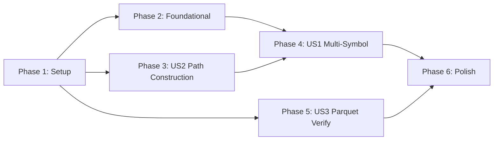

# Tasks: Multi-Symbol Concurrent Backtest

**Input**: Design documents from `/specs/013-multi-symbol-backtest/`
**Prerequisites**: plan.md ✅, spec.md ✅, research.md ✅, data-model.md ✅, quickstart.md ✅

**Tests**: Integration tests included per spec requirements (SC-004 regression, SC-001 multi-symbol execution).

**Organization**: Tasks grouped by user story to enable independent implementation and testing.

## Format: `[ID] [P?] [Story] Description`

- **[P]**: Can run in parallel (different files, no dependencies)
- **[Story]**: Which user story this task belongs to (US1, US2, US3)
- Include exact file paths in descriptions

---

## Phase 1: Setup

**Purpose**: Add constants and project structure for multi-symbol support

- [x] T001 Add `DEFAULT_ACCOUNT_BALANCE = 2500.0` constant in `src/cli/run_backtest.py`
- [x] T002 [P] Create `tests/integration/test_multi_symbol_backtest.py` test file skeleton
- [x] T003 [P] Create `tests/unit/test_path_construction.py` test file skeleton

---

## Phase 2: Foundational (Blocking Prerequisites)

**Purpose**: Update `IndependentRunner` to use vectorized Polars path - blocks US1

**⚠️ CRITICAL**: US1 multi-symbol execution depends on modernized runner

- [x] T004 Update import in `src/backtest/portfolio/independent_runner.py` from legacy `ingest_candles` to `ingest_ohlcv_data`
- [x] T005 Modify `_run_symbol_backtest()` in `src/backtest/portfolio/independent_runner.py` to use Polars vectorized path
- [x] T006 Update `_get_dataset_path()` in `src/backtest/portfolio/independent_runner.py` to support Parquet with CSV fallback
- [x] T007 Add `dataset` parameter to `IndependentRunner.run()` in `src/backtest/portfolio/independent_runner.py`

**Checkpoint**: IndependentRunner ready for vectorized multi-symbol execution

---

## Phase 3: User Story 2 - Path Construction (Priority: P1) 🎯 MVP Foundation

**Goal**: Extend CLI path construction to build paths for ALL pairs, not just first

**Independent Test**: Run `--pair EURUSD USDJPY --dataset test` and verify paths resolve for both

### Implementation for User Story 2

- [x] T008 [US2] Extract path construction logic into helper function `construct_data_paths()` in `src/cli/run_backtest.py`
- [x] T009 [US2] Modify `construct_data_paths()` to iterate over all pairs in `args.pair` in `src/cli/run_backtest.py`
- [x] T010 [US2] Add validation to check all pair paths exist before execution in `src/cli/run_backtest.py`
- [x] T011 [US2] Log constructed paths for each symbol at INFO level in `src/cli/run_backtest.py`

### Tests for User Story 2

- [ ] T012 [P] [US2] Add `test_path_construction_single_pair()` in `tests/unit/test_path_construction.py`
- [ ] T013 [P] [US2] Add `test_path_construction_multi_pair()` in `tests/unit/test_path_construction.py`
- [ ] T014 [P] [US2] Add `test_path_parquet_preferred_over_csv()` in `tests/unit/test_path_construction.py`

**Checkpoint**: Path construction works for multiple pairs

---

## Phase 4: User Story 1 - Multi-Symbol Backtest with Concurrent PnL (Priority: P1) 🎯 MVP

**Goal**: Run backtests on ALL specified pairs with aggregated PnL

**Independent Test**: Execute `--pair EURUSD USDJPY --dataset test`; verify both symbols produce trades; verify combined PnL

### Implementation for User Story 1

- [x] T015 [US1] Add `run_multi_symbol_backtest()` function in `src/cli/run_backtest.py`
- [x] T016 [US1] Implement per-symbol backtest loop calling `BacktestOrchestrator.run_backtest()` in `run_multi_symbol_backtest()`
- [x] T017 [US1] Aggregate results into multi-symbol `BacktestResult` with `symbols` and `results` fields
- [x] T018 [US1] Compute combined PnL with equal capital allocation ($2,500 / num_symbols) in `run_multi_symbol_backtest()`
- [x] T019 [US1] Add branching logic in `main()`: use `run_multi_symbol_backtest()` when `len(args.pair) > 1` in `src/cli/run_backtest.py`
- [x] T020 [US1] Wire formatters: use `format_multi_symbol_text_output()` / `format_multi_symbol_json_output()` for multi-symbol results

### Tests for User Story 1

- [ ] T021 [P] [US1] Add `test_multi_symbol_both_pairs_executed()` in `tests/integration/test_multi_symbol_backtest.py`
- [ ] T022 [P] [US1] Add `test_multi_symbol_aggregated_pnl()` in `tests/integration/test_multi_symbol_backtest.py`
- [ ] T023 [P] [US1] Add `test_multi_symbol_default_balance()` in `tests/integration/test_multi_symbol_backtest.py`
- [ ] T024 [P] [US1] Add `test_single_symbol_unchanged()` regression test in `tests/integration/test_multi_symbol_backtest.py`

**Checkpoint**: Multi-symbol backtest runs on all pairs with concurrent PnL

---

## Phase 5: User Story 3 - Parquet Pipeline Verification (Priority: P2)

**Goal**: Verify Parquet files work end-to-end through entire backtest pipeline

**Independent Test**: Run `--pair EURUSD --dataset test` with Parquet file; verify all 5 stages complete

### Implementation for User Story 3

- [ ] T025 [US3] Add `test_parquet_end_to_end_pipeline()` in `tests/integration/test_multi_symbol_backtest.py`
- [ ] T026 [US3] Add `test_parquet_fallback_to_csv()` in `tests/integration/test_multi_symbol_backtest.py`
- [ ] T027 [US3] Add `test_progress_bars_clean_display()` in `tests/integration/test_multi_symbol_backtest.py`

**Checkpoint**: Parquet pipeline verified end-to-end

---

## Phase 6: Polish & Cross-Cutting Concerns

**Purpose**: Code quality, documentation, and validation

- [ ] T028 Run Pylint on modified files: `poetry run pylint src/cli/run_backtest.py src/backtest/portfolio/independent_runner.py --score=yes` (target ≥9.5/10)
- [ ] T029 Run Ruff check: `poetry run ruff check src/cli/ src/backtest/portfolio/`
- [ ] T030 [P] Run all new tests: `poetry run pytest tests/integration/test_multi_symbol_backtest.py tests/unit/test_path_construction.py -v`
- [ ] T031 [P] Run existing multi-symbol tests for regression: `poetry run pytest tests/integration/test_multi_symbol_build.py -v`
- [ ] T032 Validate quickstart.md examples work manually
- [ ] T033 Update documentation if any path logic changes

---

## Dependencies & Execution Order

### Phase Dependencies

- **Setup (Phase 1)**: No dependencies - can start immediately
- **Foundational (Phase 2)**: Depends on Setup - BLOCKS Phase 4 (US1)
- **User Story 2 (Phase 3)**: Depends on Setup only - can run parallel with Phase 2
- **User Story 1 (Phase 4)**: Depends on Phase 2 (Foundational) AND Phase 3 (US2)
- **User Story 3 (Phase 5)**: Independent - can run after Phase 1
- **Polish (Phase 6)**: Depends on all user stories complete

### User Story Dependencies

### Parallel Opportunities

**Within Phase 1 (Setup)**:

- T002 and T003 can run in parallel

**Within Phase 3 (US2)**:

- T012, T013, T014 (tests) can run in parallel

**Within Phase 4 (US1)**:

- T021, T022, T023, T024 (tests) can run in parallel

**Cross-Phase**:

- Phase 3 (US2) and Phase 5 (US3) can run in parallel after Setup

---

## Implementation Strategy

### MVP First (User Stories 1 + 2)

1. Complete Phase 1: Setup (T001-T003)
2. Complete Phase 2: Foundational (T004-T007) - CRITICAL
3. Complete Phase 3: User Story 2 - Path Construction (T008-T014)
4. Complete Phase 4: User Story 1 - Multi-Symbol Backtest (T015-T024)
5. **STOP and VALIDATE**: Test multi-symbol run manually
6. Deploy/demo if ready

### Incremental Delivery

1. Setup + Foundational → Infrastructure ready
2. Add US2 (Path Construction) → Correct paths for all pairs
3. Add US1 (Multi-Symbol) → Core feature complete (MVP!)
4. Add US3 (Parquet Verify) → End-to-end validation
5. Polish → Production quality

---

## Notes

- [P] tasks = different files, no dependencies
- [Story] label maps task to specific user story for traceability
- US2 (Path Construction) is prerequisite for US1 (Multi-Symbol)
- Commit format: `feat(013): <Description> (T###)` per constitution
- Run `poetry run pytest` after each phase checkpoint
