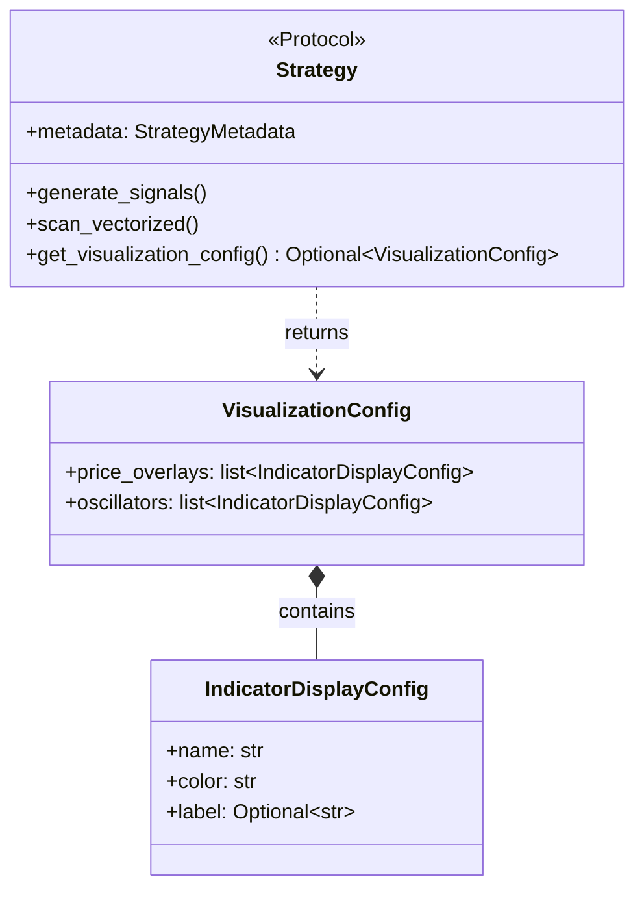

# Data Model: Dynamic Visualization Indicators

**Feature**: 017-dynamic-viz-indicators
**Date**: 2025-12-21

## Entities

### IndicatorDisplayConfig

Individual display configuration for a single indicator.

| Field   | Type  | Required | Default     | Description                                                 |
| ------- | ----- | -------- | ----------- | ----------------------------------------------------------- |
| `name`  | `str` | Yes      | -           | Indicator column name in DataFrame (e.g., "ema20", "rsi14") |
| `color` | `str` | No       | `"#FFFFFF"` | CSS color (hex, named, or rgb) for the indicator line       |
| `label` | `str` | No       | `None`      | Display label in legend; if None, uses `name`               |

**Validation Rules**:

- `name` must be non-empty string
- `color` should be valid CSS color; invalid colors fallback to white with warning
- `label` if provided, must be non-empty string

**Example**:

```python
IndicatorDisplayConfig(name="ema20", color="#FFD700", label="EMA 20")
IndicatorDisplayConfig(name="rsi14", color="cyan")  # Uses default label
```

---

### VisualizationConfig

Container for all visualization configuration for a strategy.

| Field            | Type                           | Required | Default | Description                                                       |
| ---------------- | ------------------------------ | -------- | ------- | ----------------------------------------------------------------- |
| `price_overlays` | `list[IndicatorDisplayConfig]` | No       | `[]`    | Indicators to overlay on price chart (EMAs, SMAs, ATR, etc.)      |
| `oscillators`    | `list[IndicatorDisplayConfig]` | No       | `[]`    | Indicators for oscillator panel below price (RSI, StochRSI, etc.) |

**Validation Rules**:

- Both lists can be empty (results in price-only chart)
- Duplicate indicator names are allowed (but not recommended)
- Maximum recommended: 3 price overlays, 2 oscillators (for visual clarity)

**Example**:

```python
VisualizationConfig(
    price_overlays=[
        IndicatorDisplayConfig(name="ema20", color="#FFD700", label="Fast EMA"),
        IndicatorDisplayConfig(name="ema50", color="#00CED1", label="Slow EMA"),
    ],
    oscillators=[
        IndicatorDisplayConfig(name="stoch_rsi", color="#00FFFF", label="Stoch RSI"),
    ],
)
```

---

## Relationships



---

## Color Palette Recommendations

Default colors designed for dark chart backgrounds (Bokeh dark theme):

| Indicator Type | Recommended Colors         | Rationale                                  |
| -------------- | -------------------------- | ------------------------------------------ |
| Fast EMA (20)  | `#FFD700` (Gold)           | Warm, visible, distinguishes from slow EMA |
| Slow EMA (50)  | `#00CED1` (Dark Turquoise) | Cool, contrasts with fast EMA              |
| EMA 200        | `#DA70D6` (Orchid)         | Distinct purple, rarely used               |
| RSI            | `#FFFF00` (Yellow)         | Standard for overbought/oversold           |
| StochRSI K     | `#00FFFF` (Cyan)           | Fast stochastic line                       |
| StochRSI D     | `#FF69B4` (Hot Pink)       | Signal line, contrasts with K              |
| ATR            | `#9370DB` (Medium Purple)  | Subtle, doesn't compete with EMAs          |

These colors meet WCAG 2.1 AA contrast requirements against dark backgrounds (#1a1a1a to #2d2d2d).
