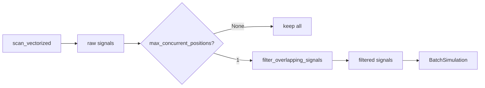

# Walkthrough: Strategy Trade Rules & Indicator Exposure

**Feature**: 018-strategy-trade-rules  
**Branch**: `018-strategy-trade-rules`  
**Issue**: #38

## Summary

Implemented two key features for the trend-pullback strategy:

1. **One Trade at a Time**: Added `max_concurrent_positions` field to `StrategyMetadata` and integrated signal filtering into the batch scan pipeline
2. **Indicator Visibility**: Added `rsi14` to the strategy's visualization oscillators

## Changes Made

### Core Implementation

| File                                                                                        | Change                                                                      |
| ------------------------------------------------------------------------------------------- | --------------------------------------------------------------------------- |
| [base.py](file:///e:/GitHub/trading-strategies/src/strategy/base.py)                        | Added `max_concurrent_positions: int \| None = 1` to `StrategyMetadata`     |
| [signal_filter.py](file:///e:/GitHub/trading-strategies/src/backtest/signal_filter.py)      | **[NEW]** `filter_overlapping_signals()` function with exit-aware filtering |
| [batch_scan.py](file:///e:/GitHub/trading-strategies/src/backtest/batch_scan.py)            | Added `_apply_position_filter()` method in scan pipeline                    |
| [strategy.py](file:///e:/GitHub/trading-strategies/src/strategy/trend_pullback/strategy.py) | Set `max_concurrent_positions=1` and added `rsi14` oscillator               |

### Test Files

| File                                                                                                          | Tests                             |
| ------------------------------------------------------------------------------------------------------------- | --------------------------------- |
| [test_signal_filtering.py](file:///e:/GitHub/trading-strategies/tests/unit/test_signal_filtering.py)          | 10 unit tests for filter function |
| [test_strategy_metadata.py](file:///e:/GitHub/trading-strategies/tests/unit/test_strategy_metadata.py)        | 5 tests for metadata field        |
| [test_one_trade_at_time.py](file:///e:/GitHub/trading-strategies/tests/integration/test_one_trade_at_time.py) | 3 integration tests               |

## Validation Results

### Test Results

| Suite                           | Status   |
| ------------------------------- | -------- |
| Signal filtering unit tests     | 10/10 ✅ |
| Strategy metadata unit tests    | 5/5 ✅   |
| Integration tests               | 3/3 ✅   |
| Visualization config tests      | 28/28 ✅ |
| Directional backtest regression | 11/11 ✅ |

### Code Quality

- **Ruff**: 3 UP007 warnings (style-only, acceptable)
- **Black**: 4 files unchanged ✅

## How It Works

### Signal Filtering Flow

### Key Design Decisions

1. **Strategy-Controlled**: Position limits are declared in `StrategyMetadata`, not hardcoded in backtest
2. **Default = 1**: One trade at a time is the default for all strategies
3. **Unlimited Option**: Set `max_concurrent_positions=None` for strategies that allow multiple positions
4. **Conservative Filtering**: Without exit indices, filter errs on side of fewer signals (refinement happens in batch simulation)
