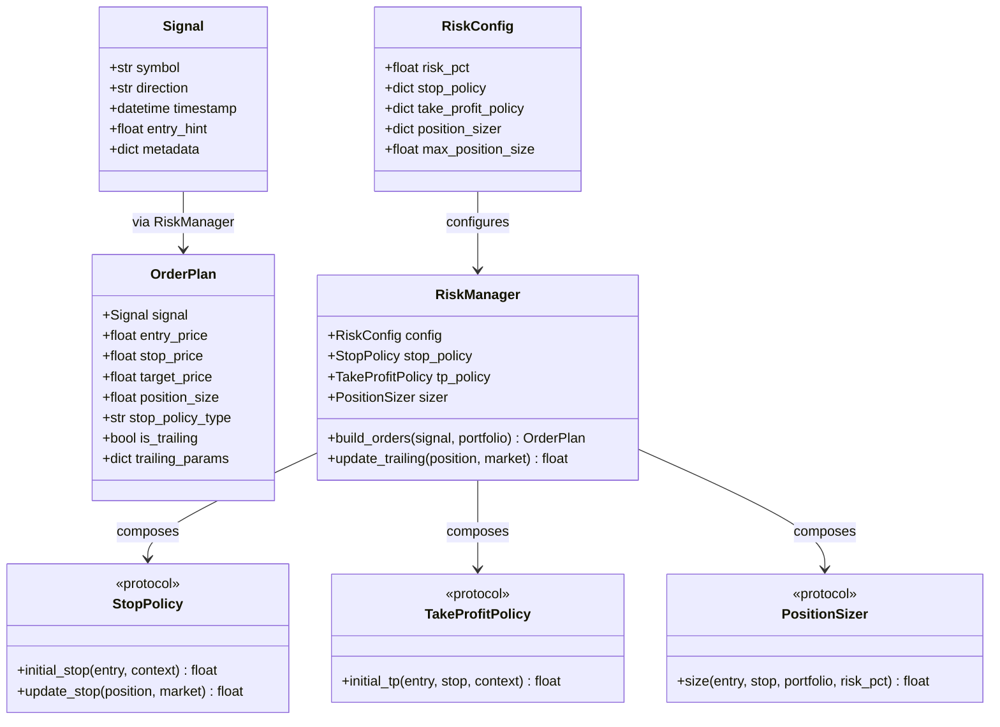

# Data Model: Decouple Risk Management

**Feature**: 021-decouple-risk-management
**Date**: 2024-12-24

## Entity Overview



---

## Entity: Signal

**Purpose**: Lightweight signal emitted by strategies containing only direction and entry information.

| Field        | Type                       | Required | Description                          |
| ------------ | -------------------------- | -------- | ------------------------------------ | ------------------------------ |
| `symbol`     | `str`                      | Yes      | Trading pair symbol (e.g., "EURUSD") |
| `direction`  | `Literal["LONG", "SHORT"]` | Yes      | Trade direction                      |
| `timestamp`  | `datetime`                 | Yes      | Signal generation time (UTC)         |
| `entry_hint` | `float                     | None`    | No                                   | Optional suggested entry price |
| `metadata`   | `dict`                     | No       | Strategy-specific tags/context       |

**Validation Rules**:

- `direction` must be "LONG" or "SHORT"
- `timestamp` must be timezone-aware (UTC)
- `symbol` must be non-empty string

---

## Entity: OrderPlan

**Purpose**: Complete order specification output by RiskManager, ready for execution.

| Field              | Type     | Required | Description                      |
| ------------------ | -------- | -------- | -------------------------------- | --------------------------------------- |
| `signal`           | `Signal` | Yes      | Original signal reference        |
| `entry_price`      | `float`  | Yes      | Actual entry price               |
| `stop_price`       | `float`  | Yes      | Initial stop-loss price          |
| `target_price`     | `float   | None`    | No                               | Take-profit price (None for trail-only) |
| `position_size`    | `float`  | Yes      | Position size in lots            |
| `stop_policy_type` | `str`    | Yes      | Name of stop policy used         |
| `is_trailing`      | `bool`   | Yes      | Whether stop updates dynamically |
| `trailing_params`  | `dict`   | No       | Parameters for trailing updates  |

**Validation Rules**:

- `position_size` must be > 0
- `stop_price` must differ from `entry_price`
- For LONG: `stop_price < entry_price`
- For SHORT: `stop_price > entry_price`

---

## Entity: RiskConfig

**Purpose**: Configuration object defining risk policy selection and parameters.

| Field                | Type    | Required | Default                                     | Description                  |
| -------------------- | ------- | -------- | ------------------------------------------- | ---------------------------- |
| `risk_pct`           | `float` | No       | 0.25                                        | Risk per trade as percentage |
| `stop_policy`        | `dict`  | No       | `{"type": "ATR", "multiplier": 2.0}`        | Stop policy configuration    |
| `take_profit_policy` | `dict`  | No       | `{"type": "RiskMultiple", "rr_ratio": 2.0}` | TP policy configuration      |
| `position_sizer`     | `dict`  | No       | `{"type": "RiskPercent"}`                   | Sizing algorithm             |
| `max_position_size`  | `float` | No       | 10.0                                        | Maximum lots per trade       |

**JSON Schema**:

```json
{
  "$schema": "http://json-schema.org/draft-07/schema#",
  "type": "object",
  "properties": {
    "risk_pct": { "type": "number", "minimum": 0.01, "maximum": 10.0 },
    "stop_policy": {
      "type": "object",
      "properties": {
        "type": { "enum": ["ATR", "ATR_Trailing", "FixedPips"] },
        "multiplier": { "type": "number" },
        "period": { "type": "integer" },
        "pips": { "type": "number" }
      },
      "required": ["type"]
    },
    "take_profit_policy": {
      "type": "object",
      "properties": {
        "type": { "enum": ["RiskMultiple", "None"] },
        "rr_ratio": { "type": "number" }
      },
      "required": ["type"]
    }
  }
}
```

---

## Protocol: StopPolicy

**Purpose**: Interface for stop-loss calculation strategies.

```python
class StopPolicy(Protocol):
    """Calculate initial and updated stop-loss prices."""

    def initial_stop(
        self,
        entry_price: float,
        direction: str,
        context: dict  # Contains ATR, high, low, close
    ) -> float:
        """Calculate initial stop-loss price."""
        ...

    def update_stop(
        self,
        current_stop: float,
        entry_price: float,
        direction: str,
        market: dict  # Contains high, low, close, ATR
    ) -> float:
        """Calculate updated stop for trailing policies. Return current_stop if no update."""
        ...
```

**Implementations**:

- `ATRStop`: Fixed ATR-based stop, `update_stop` returns unchanged.
- `ATRTrailingStop`: Trailing ATR stop, ratchets in favorable direction.
- `FixedPipsStop`: Fixed pip distance stop.

---

## Protocol: TakeProfitPolicy

**Purpose**: Interface for take-profit calculation strategies.

```python
class TakeProfitPolicy(Protocol):
    """Calculate take-profit price."""

    def initial_tp(
        self,
        entry_price: float,
        stop_price: float,
        direction: str,
        context: dict
    ) -> float | None:
        """Calculate take-profit price. Return None for trail-only strategies."""
        ...
```

**Implementations**:

- `RiskMultipleTP`: TP at N× risk distance (e.g., 3:1).
- `NoTakeProfit`: Returns None (position exits only at stop or manual close).

---

## Protocol: PositionSizer

**Purpose**: Interface for position size calculations.

```python
class PositionSizer(Protocol):
    """Calculate position size based on risk parameters."""

    def size(
        self,
        entry_price: float,
        stop_price: float,
        portfolio_balance: float,
        risk_pct: float,
        pip_value: float = 10.0,
        lot_step: float = 0.01,
        max_size: float = 10.0
    ) -> float:
        """Calculate position size in lots."""
        ...
```

**Implementations**:

- `RiskPercentSizer`: Position size = risk_amount / (stop_distance × pip_value).

---

## State Transitions

### OrderPlan Lifecycle

```text
[Created] → [Submitted] → [Filled] → [Active] → [Closed]
                                        ↓
                                  (trailing updates)
```

### Stop Price Updates (Trailing)

```text
Initial Stop → (price moves favorably) → Updated Stop → ... → Exit
     ↓
(price moves against)
     ↓
Stop Unchanged (never widens)
```

---

## Relationships

| From        | To               | Relationship | Cardinality    |
| ----------- | ---------------- | ------------ | -------------- |
| Strategy    | Signal           | produces     | 1:N            |
| RiskManager | OrderPlan        | creates      | 1:1 per Signal |
| RiskManager | StopPolicy       | composes     | 1:1            |
| RiskManager | TakeProfitPolicy | composes     | 1:1            |
| RiskManager | PositionSizer    | composes     | 1:1            |
| RiskConfig  | RiskManager      | configures   | 1:1            |
