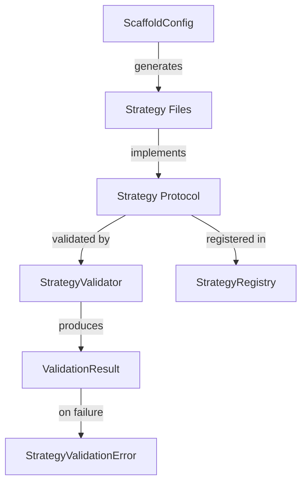
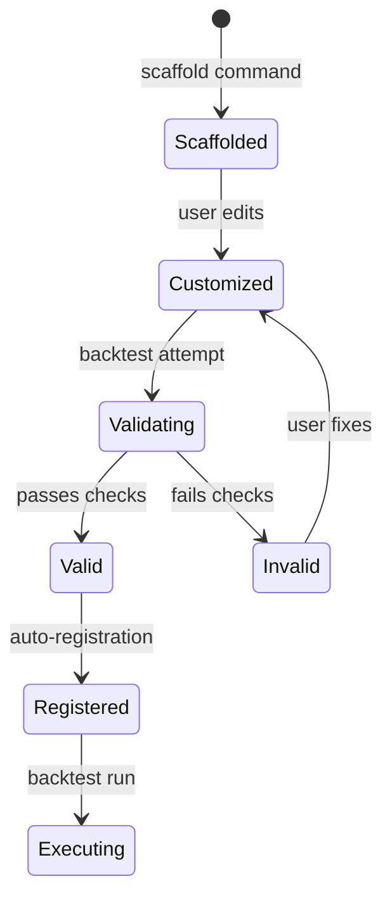

# Data Model: Strategy Templating Framework

**Feature**: 022-strategy-templating
**Date**: 2025-12-26

## Entities

### ValidationResult

Represents the result of validating a strategy against the contract.

| Field           | Type      | Description                                          |
| --------------- | --------- | ---------------------------------------------------- |
| is_valid        | bool      | True if strategy passes all validation checks        |
| errors          | list[str] | List of validation error messages                    |
| strategy_name   | str       | Name extracted from strategy metadata (if available) |
| checked_methods | list[str] | Methods that were validated                          |

**Lifecycle**: Created during validation, read-only after creation.

### StrategyValidationError

Exception raised when validation fails and hard-fail is enabled.

| Field       | Type      | Description                          |
| ----------- | --------- | ------------------------------------ |
| message     | str       | Human-readable error summary         |
| errors      | list[str] | Detailed list of validation failures |
| suggestions | list[str] | Suggested fixes for each error       |

### ScaffoldConfig

Configuration for scaffold generation.

| Field       | Type      | Description                                        |
| ----------- | --------- | -------------------------------------------------- |
| name        | str       | Strategy name (used for class and directory)       |
| output_dir  | Path      | Target directory (default: `src/strategy/<name>/`) |
| author      | str       | Optional author name for template                  |
| description | str       | Optional strategy description                      |
| indicators  | list[str] | Optional list of required indicators               |

**Validation Rules**:

- `name` must be valid Python identifier (alphanumeric + underscore, not starting with number)
- `name` must not conflict with existing strategy directories
- `output_dir` must be writable

## Relationships

## State Transitions

### Scaffolded Strategy Lifecycle

## Existing Entities (Unchanged)

### StrategyMetadata

Already exists in `src/strategy/base.py`. No modifications needed.

| Field                    | Type      | Description                   |
| ------------------------ | --------- | ----------------------------- | -------------- |
| name                     | str       | Unique strategy identifier    |
| version                  | str       | Semantic version string       |
| required_indicators      | list[str] | Indicators needed by strategy |
| tags                     | list[str] | Classification tags           |
| max_concurrent_positions | int       | None                          | Position limit |

### Strategy Protocol

Already exists in `src/strategy/base.py`. No modifications needed.

| Method                   | Required | Description                         |
| ------------------------ | -------- | ----------------------------------- |
| metadata                 | Yes      | Property returning StrategyMetadata |
| generate_signals         | Yes      | Generate trade signals from candles |
| scan_vectorized          | No       | Optimized batch signal scanning     |
| get_visualization_config | No       | Chart display configuration         |
