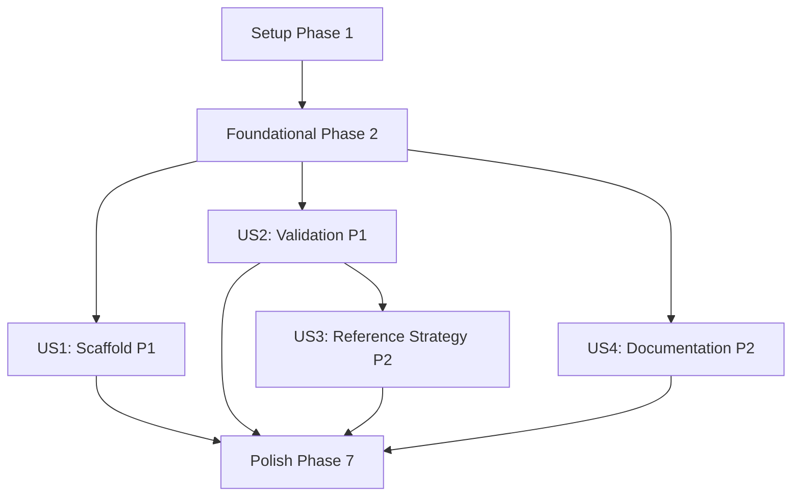

# Tasks: Strategy Templating Framework

**Input**: Design documents from `/specs/022-strategy-templating/`
**Prerequisites**: plan.md ✓, spec.md ✓, research.md ✓, data-model.md ✓, contracts/ ✓, quickstart.md ✓

**Tests**: Integration and unit tests included as this is a developer-facing feature requiring validation.

**Organization**: Tasks grouped by user story to enable independent implementation and testing.

## Format: `[ID] [P?] [Story] Description`

- **[P]**: Can run in parallel (different files, no dependencies)
- **[Story]**: Which user story this task belongs to (US1, US2, US3, US4)
- Include exact file paths in descriptions

---

## Phase 1: Setup (Shared Infrastructure)

**Purpose**: Project initialization, dependencies, and shared scaffold infrastructure

- [ ] T001 Add Jinja2 dependency to pyproject.toml per research.md decision
- [ ] T002 Create scaffold directory structure at src/strategy/scaffold/
- [ ] T003 [P] Create src/strategy/scaffold/**init**.py with module exports
- [ ] T004 [P] Create src/strategy/scaffold/templates/ directory for Jinja2 templates

---

## Phase 2: Foundational (Blocking Prerequisites)

**Purpose**: Core validation infrastructure that MUST be complete before user story implementation

**⚠️ CRITICAL**: User Story 1 (Scaffold) and User Story 2 (Validation) share the validator component

- [ ] T005 Create ValidationResult dataclass in src/strategy/validator.py per data-model.md
- [ ] T006 Create StrategyValidationError exception in src/strategy/validator.py per data-model.md
- [ ] T007 Implement validate_strategy() function in src/strategy/validator.py per contracts/validator-api.md
- [ ] T008 Add validate_on_register parameter to StrategyRegistry.register() in src/strategy/registry.py

**Checkpoint**: Foundation ready - user story implementation can now begin

---

## Phase 3: User Story 1 - Create New Strategy from Template (Priority: P1) 🎯 MVP

**Goal**: Users can run a scaffold command that generates a working strategy template with TODO markers

**Independent Test**: Run scaffold command, then execute backtest with generated template, verify no runtime errors

### Tests for User Story 1

- [ ] T009 [P] [US1] Create unit test for ScaffoldGenerator in tests/unit/test_scaffold_generator.py
- [ ] T010 [P] [US1] Create integration test for scaffold CLI in tests/integration/test_strategy_scaffold_e2e.py

### Implementation for User Story 1

- [ ] T011 [P] [US1] Create strategy.py.j2 template in src/strategy/scaffold/templates/strategy.py.j2
- [ ] T012 [P] [US1] Create **init**.py.j2 template in src/strategy/scaffold/templates/**init**.py.j2
- [ ] T013 [P] [US1] Create signal_generator.py.j2 template in src/strategy/scaffold/templates/signal_generator.py.j2
- [ ] T014 [US1] Implement ScaffoldGenerator class in src/strategy/scaffold/generator.py (depends on T011-T013)
- [ ] T015 [US1] Implement scaffold CLI command in src/cli/scaffold_strategy.py per contracts/validator-api.md
- [ ] T016 [US1] Add auto-registration logic to scaffold_strategy.py (calls registry.register after generation)
- [ ] T017 [US1] Verify scaffolded strategy runs in basic backtest without modification

**Checkpoint**: User Story 1 complete - users can scaffold new strategies via CLI

---

## Phase 4: User Story 2 - Validate Strategy Contract at Load Time (Priority: P1)

**Goal**: System validates strategy contract at startup and fails fast with clear error messages

**Independent Test**: Create incomplete strategy (missing method), run backtest, verify clear error message

### Tests for User Story 2

- [ ] T018 [P] [US2] Create unit tests for validator in tests/unit/test_strategy_validator.py (missing method detection)
- [ ] T019 [P] [US2] Create unit tests for validator in tests/unit/test_strategy_validator.py (invalid metadata detection)
- [ ] T020 [P] [US2] Create unit tests for validator in tests/unit/test_strategy_validator.py (wrong signature detection)

### Implementation for User Story 2

- [ ] T021 [US2] Add metadata property validation to validate_strategy() in src/strategy/validator.py
- [ ] T022 [US2] Add generate_signals method validation with signature check in src/strategy/validator.py
- [ ] T023 [US2] Add StrategyMetadata field validation (name, version, required_indicators) in src/strategy/validator.py
- [ ] T024 [US2] Implement suggestion generation for error messages in src/strategy/validator.py per FR-006
- [ ] T025 [US2] Add fail-fast exit behavior on validation failure (sys.exit with non-zero code)

**Checkpoint**: User Story 2 complete - contract violations caught at load time with actionable errors

---

## Phase 5: User Story 3 - Reference Strategy Implementation (Priority: P2)

**Goal**: Working reference strategy that demonstrates template pattern and produces trades in backtest

**Independent Test**: Run reference strategy in backtest, verify it generates at least one trade signal

### Implementation for User Story 3

- [ ] T026 [P] [US3] Create src/strategy/simple_momentum/**init**.py with module exports
- [ ] T027 [US3] Implement SimpleMomentumStrategy class in src/strategy/simple_momentum/strategy.py
- [ ] T028 [US3] Add comprehensive docstrings explaining each section in simple_momentum/strategy.py per FR-007
- [ ] T029 [US3] Register simple_momentum strategy in strategy registry
- [ ] T030 [US3] Verify reference strategy passes validation and produces trades in test backtest

**Checkpoint**: User Story 3 complete - reference strategy available for learning

---

## Phase 6: User Story 4 - Strategy Authoring Documentation (Priority: P2)

**Goal**: Complete strategy authoring guide explaining lifecycle, constraints, and integration points

**Independent Test**: New user can read documentation and implement strategy without additional assistance

### Implementation for User Story 4

- [ ] T031 [US4] Create docs/strategy_authoring.md with Strategy Lifecycle section per FR-009
- [ ] T032 [US4] Add Required Methods section with complete signatures in docs/strategy_authoring.md
- [ ] T033 [US4] Add Indicator Integration section in docs/strategy_authoring.md
- [ ] T034 [US4] Add Risk Management Integration section in docs/strategy_authoring.md
- [ ] T035 [US4] Add Examples and Troubleshooting section in docs/strategy_authoring.md

**Checkpoint**: User Story 4 complete - documentation covers all required methods and lifecycle

---

## Phase 7: Polish & Cross-Cutting Concerns

**Purpose**: Final verification, code quality, and cross-story integration

- [ ] T036 [P] Run full test suite to verify no regressions: `poetry run pytest tests/ -v`
- [ ] T037 [P] Run Black formatting: `poetry run black src/ tests/`
- [ ] T038 [P] Run Ruff linting: `poetry run ruff check src/ tests/`
- [ ] T039 Run Pylint with target ≥9.0: `poetry run pylint src/ --score=yes`
- [ ] T040 Update src/cli/**init**.py docstring to document new scaffold_strategy command
- [ ] T041 Run quickstart.md validation (manual test of scaffold → backtest flow)

---

## Dependencies & Execution Order

### Phase Dependencies

- **Setup (Phase 1)**: No dependencies - can start immediately
- **Foundational (Phase 2)**: Depends on Setup completion
- **User Story 1 (Phase 3)**: Depends on Foundational (especially T005-T007 validator)
- **User Story 2 (Phase 4)**: Depends on Foundational (T005-T008)
- **User Story 3 (Phase 5)**: Depends on User Story 2 (needs validator to pass)
- **User Story 4 (Phase 6)**: Can start after Foundational (documentation only)
- **Polish (Phase 7)**: Depends on all user stories being complete

### User Story Dependencies



### Within Each User Story

- Tests FIRST (T009-T010, T018-T020)
- Templates before generator (T011-T013 before T014)
- Generator before CLI (T014 before T015)
- Verification last (T017, T030)

### Parallel Opportunities

**Phase 1**: T003 and T004 can run in parallel
**Phase 3**: T009-T010 (tests) can run in parallel; T011-T013 (templates) can run in parallel
**Phase 4**: T018-T020 (tests) can run in parallel
**Phase 5**: T026 can run in parallel with other work
**Phase 7**: T036-T038 can all run in parallel

---

## Parallel Example: User Story 1 Templates

```bash
# Launch all template creation tasks together:
Task T011: "Create strategy.py.j2 template in src/strategy/scaffold/templates/"
Task T012: "Create __init__.py.j2 template in src/strategy/scaffold/templates/"
Task T013: "Create signal_generator.py.j2 template in src/strategy/scaffold/templates/"
```

---

## Implementation Strategy

### MVP First (User Story 1 + User Story 2)

1. Complete Phase 1: Setup
2. Complete Phase 2: Foundational
3. Complete Phase 3: User Story 1 (Scaffold)
4. Complete Phase 4: User Story 2 (Validation)
5. **STOP and VALIDATE**: Test scaffold → validate → backtest flow
6. Deploy/demo if ready (MVP complete!)

### Incremental Delivery

1. Setup + Foundational → Infrastructure ready
2. Add User Story 1 → Test scaffold command → Demo
3. Add User Story 2 → Test validation errors → Demo
4. Add User Story 3 → Reference strategy available
5. Add User Story 4 → Documentation complete
6. Polish → Release ready

---

## Notes

- [P] tasks = different files, no dependencies
- [Story] label maps task to specific user story for traceability
- User Stories 1 and 2 are both P1 priority - implement in order shown (scaffold needs templates first)
- Reference strategy (US3) requires validator (US2) to pass validation
- Documentation (US4) can proceed in parallel once Foundational is complete
- Commit after each task following Principle XI commit message standards
