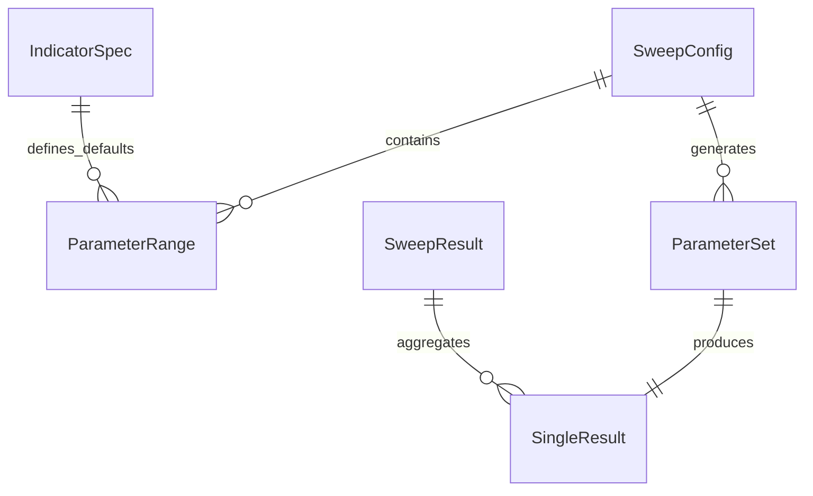
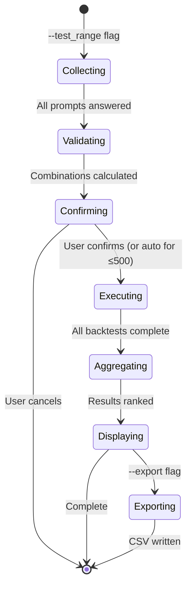

# Data Model: Parallel Indicator Parameter Sweep

**Feature**: 024-parallel-param-sweep
**Date**: 2025-12-30

## Entity Definitions

### IndicatorSpec (Existing - Extended)

Registry entry for an indicator with configurable parameters.

| Field    | Type           | Description                                  |
| -------- | -------------- | -------------------------------------------- |
| name     | str            | Unique identifier (semantic or period-based) |
| requires | list[str]      | Required input columns                       |
| provides | list[str]      | Output column names                          |
| compute  | Callable       | Computation function                         |
| params   | dict[str, Any] | **Key for sweeps**: default parameter values |
| version  | str            | Semantic version                             |

### ParameterRange

Represents user input for a single parameter that may be a range or fixed value.

| Field          | Type               | Description                                          |
| -------------- | ------------------ | ---------------------------------------------------- |
| indicator_name | str                | Semantic indicator name (e.g., "fast_ema")           |
| param_name     | str                | Parameter key (e.g., "period")                       |
| values         | list[int \| float] | Expanded values to test                              |
| is_range       | bool               | True if user specified range, False for single value |

**Construction**:

- Fixed value `15` → `values=[15]`, `is_range=False`
- Range `10-30 step 5` → `values=[10, 15, 20, 25, 30]`, `is_range=True`

### ParameterSet

A specific combination of all parameter values for one backtest run.

| Field  | Type                      | Description                             |
| ------ | ------------------------- | --------------------------------------- |
| params | dict[str, dict[str, Any]] | `{indicator_name: {param_name: value}}` |
| label  | str                       | Human-readable label for results        |

**Example**:

```python
ParameterSet(
    params={
        "fast_ema": {"period": 15},
        "slow_ema": {"period": 60},
        "atr": {"period": 14},
        "stoch_rsi": {"rsi_period": 14, "stoch_period": 14},
    },
    label="fast_ema.period=15, slow_ema.period=60"
)
```

### SweepConfig

Configuration collected from user prompts for a full parameter sweep.

| Field              | Type                 | Description                          |
| ------------------ | -------------------- | ------------------------------------ |
| strategy_name      | str                  | Strategy being tested                |
| ranges             | list[ParameterRange] | All parameter ranges                 |
| total_combinations | int                  | Cartesian product size               |
| skipped_count      | int                  | Combinations filtered by constraints |

### SweepResult

Aggregated results from all parameter combinations.

| Field                  | Type               | Description                                    |
| ---------------------- | ------------------ | ---------------------------------------------- |
| results                | list[SingleResult] | Per-combination results                        |
| best_params            | ParameterSet       | Highest-ranked parameter set                   |
| ranking_metric         | str                | Metric used for ranking (e.g., "sharpe_ratio") |
| execution_time_seconds | float              | Total sweep duration                           |

### SingleResult

Result from one backtest with a specific parameter set.

| Field        | Type         | Description       |
| ------------ | ------------ | ----------------- |
| params       | ParameterSet | Parameters used   |
| sharpe_ratio | float        | Sharpe ratio      |
| total_pnl    | float        | Total profit/loss |
| win_rate     | float        | Win percentage    |
| trade_count  | int          | Number of trades  |
| max_drawdown | float        | Maximum drawdown  |

## Relationships



## State Transitions


