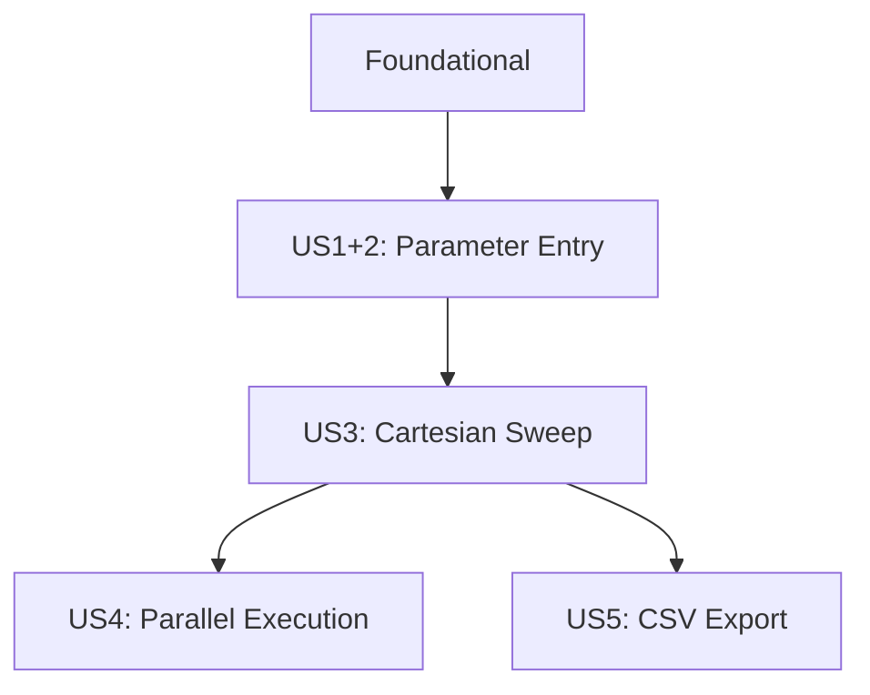

# Tasks: Parallel Indicator Parameter Sweep

**Input**: Design documents from `/specs/024-parallel-param-sweep/`
**Prerequisites**: plan.md, spec.md, research.md, data-model.md, quickstart.md

## Format: `[ID] [P?] [Story] Description`

- **[P]**: Can run in parallel (different files, no dependencies)
- **[Story]**: Which user story this task belongs to (e.g., US1, US2, US3)
- Include exact file paths in descriptions

---

## Phase 1: Setup

**Purpose**: Project initialization and directory structure

- [x] T001 Create `src/cli/prompts/` directory for interactive input modules
- [x] T002 Create `src/cli/prompts/__init__.py` package file

---

## Phase 2: Foundational (Blocking Prerequisites)

**Purpose**: Registry extensions that ALL user stories depend on

**⚠️ CRITICAL**: User story work cannot begin until semantic indicators are registered

- [x] T003 [P] Register `fast_ema` semantic indicator in `src/indicators/registry/builtins.py`
- [x] T004 [P] Register `slow_ema` semantic indicator in `src/indicators/registry/builtins.py`
- [x] T005 [P] Register `atr` semantic indicator alias in `src/indicators/registry/builtins.py`
- [x] T006 Update TrendPullbackStrategy metadata to use semantic names in `src/strategy/trend_pullback/strategy.py`
- [x] T007 Update `scan_vectorized()` to use semantic indicator names in `src/strategy/trend_pullback/strategy.py`
- [x] T008 Update `get_visualization_config()` to use semantic indicator names in `src/strategy/trend_pullback/strategy.py`

**Checkpoint**: Semantic indicators registered, strategy updated - user story implementation can begin

---

## Phase 2.5: Fixes & Debugging (CRITICAL)

**Purpose**: Address issues discovered during initial testing regarding registration timing and hardcoded indicator names.

- [x] T008a Ensure indicator registration runs at CLI startup in `src/cli/run_backtest.py`
- [x] T008b Register `rsi` semantic indicator alias in `src/indicators/registry/builtins.py`
- [x] T008c Update `signal_generator_vectorized.py` to use semantic indicator names
- [x] T008d Update `signal_generator.py` to use semantic indicator names
- [x] T008e Update `trend_classifier.py` to use semantic indicator names
- [x] T008f Handle hardcoded `atr14` in `src/backtest/orchestrator.py`
- [x] T008g Address lint issues in `signal_generator_vectorized.py`
- [x] T008h Refactor `simulate_trades_batch` for per-trade SL/TP (Verified: already supported)
- [x] T008i Update `orchestrator.py` to handle `simulate_trades_batch` changes (Verified: already handled)

---

## Phase 3: User Story 1 & 2 - Interactive Parameter Entry + Semantic Names (Priority: P1) 🎯 MVP

**Goal**: CLI prompts user for each indicator parameter, showing defaults, accepting ranges

**Independent Test**: Run `--test_range` and verify all indicator parameters are prompted with correct defaults from registry

### Implementation for User Stories 1 & 2

- [x] T009 [P] [US1] Create `ParameterRange` dataclass in `src/backtest/sweep.py`
- [x] T010 [P] [US1] Create `ParameterSet` dataclass in `src/backtest/sweep.py`
- [x] T011 [P] [US1] Create `SweepConfig` dataclass in `src/backtest/sweep.py`
- [x] T012 [US1] Implement `parse_range_input()` function in `src/backtest/sweep.py`
- [x] T013 [US1] Implement `prompt_for_indicator_params()` in `src/cli/prompts/range_input.py`
- [x] T014 [US1] Implement `collect_all_ranges()` in `src/cli/prompts/range_input.py`
- [x] T015 [US1] Add `--test_range` argument to `src/cli/run_backtest.py`
- [x] T016 [US1] Add sweep mode entry point in `main()` of `src/cli/run_backtest.py`
- [x] T017 [US1] Add input validation with clear error messages for malformed range syntax

**Checkpoint**: `--test_range` flag works, prompts appear with defaults, ranges are parsed

---

## Phase 4: User Story 3 - Multi-Parameter Cartesian Sweep (Priority: P2)

**Goal**: Generate cartesian product of all parameter ranges and execute backtests

**Independent Test**: Specify 2 parameter ranges, verify all combinations are generated and tested

### Implementation for User Story 3

- [x] T018 [P] [US3] Create `SingleResult` dataclass in `src/backtest/sweep.py`
- [x] T019 [P] [US3] Create `SweepResult` dataclass in `src/backtest/sweep.py`
- [x] T020 [US3] Implement `generate_combinations()` cartesian product in `src/backtest/sweep.py`
- [x] T021 [US3] Implement `filter_invalid_combinations()` with constraint checking in `src/backtest/sweep.py`
- [x] T022 [US3] Implement `run_single_backtest()` worker function in `src/backtest/sweep.py`
- [x] T023 [US3] Implement `run_sweep()` orchestrator in `src/backtest/sweep.py`
- [x] T024 [US3] Add confirmation prompt for large sweeps (>500 combinations) in `src/cli/prompts/range_input.py`
- [x] T025 [US3] Add progress display using Rich during sweep execution in `src/backtest/sweep.py`
- [x] T026 [US3] Implement results ranking by Sharpe ratio in `src/backtest/sweep.py`
- [x] T027 [US3] Display results table with parameter labels in `src/backtest/sweep.py`

**Checkpoint**: Cartesian product generated, backtests run sequentially, results displayed

---

## Phase 5: User Story 4 - Parallel Execution with Worker Control (Priority: P3)

**Goal**: Run backtests in parallel using ProcessPoolExecutor with optional max-workers limit

**Independent Test**: Run sweep with different `--max-workers` settings and measure speedup

### Implementation for User Story 4

- [x] T028 [US4] Integrate `run_parallel()` from `src/backtest/parallel.py` into sweep execution
- [x] T029 [US4] Add `--max-workers` argument to `src/cli/run_backtest.py`
- [x] T030 [US4] Add `--sequential` argument for debugging mode in `src/cli/run_backtest.py`
- [x] T031 [US4] Pass worker configuration through sweep orchestrator in `src/backtest/sweep.py`

**Checkpoint**: Parallel execution works, speedup observed with multiple workers

---

## Phase 6: User Story 5 - Results Export (Priority: P3)

**Goal**: Export sweep results to CSV with all parameter combinations and metrics

**Independent Test**: Run sweep with `--export results.csv` and verify CSV content

### Implementation for User Story 5

- [x] T032 [US5] Add `--export` argument to `src/cli/run_backtest.py`
- [x] T033 [US5] Implement `export_results_to_csv()` in `src/backtest/sweep.py`
- [x] T034 [US5] Wire export to sweep completion in sweep orchestrator

**Checkpoint**: CSV export works with all expected columns

---

## Phase 7: Testing & Verification

**Purpose**: Unit and integration tests for sweep functionality

- [ ] T035 [P] Create `tests/unit/test_range_parser.py` with `parse_range_input()` tests
- [ ] T036 [P] Create `tests/unit/test_sweep_generation.py` with cartesian product tests
- [ ] T037 Create `tests/integration/test_parameter_sweep.py` with end-to-end sweep tests
- [ ] T038 Run all tests: `poetry run pytest tests/unit/test_range_parser.py tests/unit/test_sweep_generation.py tests/integration/test_parameter_sweep.py -v`

---

## Phase 8: Polish & Cross-Cutting Concerns

**Purpose**: Code quality and documentation

- [ ] T039 [P] Run Black formatter on all new files
- [ ] T040 [P] Run Ruff linter on all new files
- [ ] T041 [P] Run Pylint on all new files (target ≥8.0 score)
- [ ] T042 Update `quickstart.md` with actual CLI output examples
- [ ] T043 Manual verification: Run full interactive sweep as documented in plan.md

---

## Dependencies & Execution Order

### Phase Dependencies

- **Setup (Phase 1)**: No dependencies - can start immediately
- **Foundational (Phase 2)**: Depends on Setup - BLOCKS all user stories
- **User Stories 1&2 (Phase 3)**: Depends on Foundational (T003-T008)
- **User Story 3 (Phase 4)**: Depends on US1&2 (T009-T017)
- **User Story 4 (Phase 5)**: Depends on US3 (T018-T027)
- **User Story 5 (Phase 6)**: Depends on US3 (T018-T027), parallel with US4
- **Testing (Phase 7)**: Depends on all user stories
- **Polish (Phase 8)**: Depends on Testing

### User Story Dependencies



### Parallel Opportunities

**Phase 1 (Setup)**:

```text
T001 and T002 run in sequence (T002 depends on T001)
```

**Phase 2 (Foundational)**:

```text
T003, T004, T005 can run in parallel (different indicator registrations)
T006, T007, T008 must run after T003-T005 (strategy depends on indicators)
```

**Phase 3 (US1+2)**:

```text
T009, T010, T011 can run in parallel (different dataclasses)
T012+ depends on dataclasses
```

**Phase 4 (US3)**:

```text
T018, T019 can run in parallel (different dataclasses)
```

**Phase 7 (Testing)**:

```text
T035, T036 can run in parallel (unit tests for different modules)
```

---

## Implementation Strategy

### MVP First (User Stories 1 & 2 Only)

1. Complete Phase 1: Setup
2. Complete Phase 2: Foundational
3. Complete Phase 3: User Stories 1 & 2
4. **STOP and VALIDATE**: Test interactive prompting works
5. Demo if ready

### Incremental Delivery

1. Setup + Foundational → Foundation ready
2. Add US1+2 → Interactive prompting works (MVP!)
3. Add US3 → Full sweep execution
4. Add US4 → Parallel speedup
5. Add US5 → CSV export
6. Testing + Polish → Production ready

---

## Notes

- [P] tasks = different files, no dependencies
- [Story] label maps task to specific user story
- US1 and US2 combined in Phase 3 (tightly coupled: prompting requires semantic names)
- Verify sweep completion before adding parallel execution
- Commit after each task following `feat(024): Description (TXXX)` format
